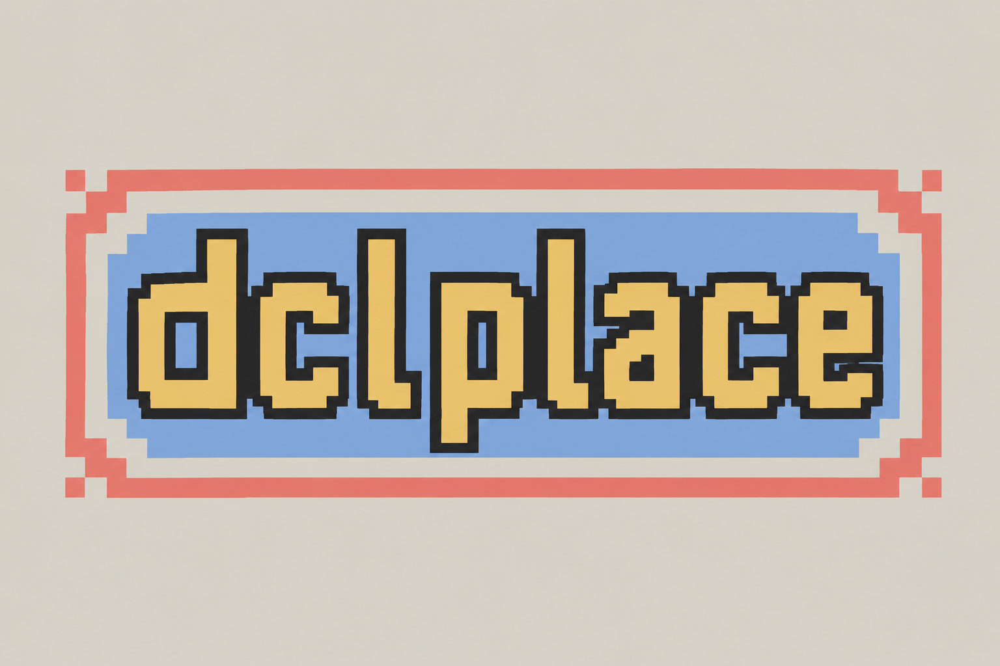

# dcl/place

> **The eternal collaborative pixel canvas of Decentraland.**
> Place one pixel every second. Nothing ever resets.

A mobile-first Decentraland re-imagining of Reddit's r/place: a single giant walkable pixel canvas that lives in a Decentraland World, is shared by every visitor, and **persists forever**. Pixels placed today may still be there in a year. Tribes form, defend territory, alliances rise and fall — the whole social drama of r/place, native to a 3D social world.

**Live:** [`dclplace.dcl.eth`](https://decentraland.org/play/?realm=dclplace.dcl.eth)
**Submission:** Friendzone Mobile Buildathon (Sep 7, 2026)



---

## The pitch

- **One pixel every second.** Server-enforced per-wallet cooldown, no exceptions.
- **Nothing resets.** No rounds, no daily wipes, no scheduled events. The canvas *is* the experience.
- **8-color palette.** Classic r/place restraint — every collaboration decision matters.
- **Mobile-first.** Tap-to-place is better on touch than mouse; every affordance works one-handed.
- **Automatic timelapse.** The server posts periodic PNG snapshots to a Discord webhook — the channel *is* the archive.

---

## How to play

1. Walk onto the canvas. A colored highlight cube tracks your feet, previewing your next placement.
2. Pick a color from the 8-swatch palette at the bottom of the screen.
3. Tap the **paint button** (or press **F** on desktop) to place a pixel where you're standing.
4. The button refills over 1 second — when it's full, you can paint again.
5. Open the **spectator camera** (top-left button, or press **1**) for a top-down overview.

### Desktop hotkeys
| Key | Action |
|---|---|
| `F` | Place pixel |
| `E` | Cycle to next palette color |
| `1` | Toggle spectator camera |
| `2` | Toggle mute |
| `3` | Toggle leaderboard |
| `4` | Toggle help panel |

### Mobile
The four native on-screen buttons are repurposed: eye = spectator, `E` = mute, `F` = leaderboard, `+` = help. The `click` hint on the paint button appears when your cooldown is ready.

---

## Scene

| | |
|---|---|
| **World** | `dclplace.dcl.eth` |
| **Parcels** | 20 × 20 = 400 (320m × 320m) |
| **Canvas** | 320 × 320 = **102,400 pixels**, 1m per pixel |
| **Palette** | 8 colors (blue, red, yellow, green, purple, orange, white, black) |
| **Cooldown** | 1 second per wallet (server-enforced) |
| **SDK** | `@dcl/sdk@auth-server` (authoritative Multiplayer Server) |

---

## Architecture

Single codebase, branched at the entry point via the **async** `isServer()` from `~system/EngineApi` (never the sync helper from `@dcl/sdk/network` — it starts false and races `main()`).

```
src/
├── index.ts              # async isServer() branch
├── shared/               # loaded by BOTH sides
│   ├── messages.ts       # placePixel, cooldownAck, joinRoster, updateName, requestLeaderboard
│   ├── components.ts     # PaintCell, PaletteEntry, PaintCoverage, LeaderboardState
│   ├── palette.ts        # 8-color PLACE_PALETTE (+ unpainted grey #EAEAEA — see invariant below)
│   ├── settings.ts       # PAINT_COOLDOWN_MS, scene geometry, tuning knobs
│   ├── paintGrid.ts      # cellId ↔ world-coord math (uint32 packing)
│   ├── paintSync.ts      # syncEntity wiring (server-only writes)
│   └── maze/             # tile-grid generator (verbatim from dcl-canvas)
├── server/               # isServer() === true
│   ├── server.ts         # message handlers + 30s canvas flush + 1s leaderboard tick + snapshot auto-post
│   ├── paintState.ts     # authoritative cell map + palette interning
│   ├── canvasStorage.ts  # Storage.get/set for the eternal canvas (single blob, dirty-flushed)
│   ├── leaderboard.ts    # top-100 all-time paint counts, dirty-tick published
│   ├── snapshotDiscord.ts# server-side PNG encoder + Discord webhook multipart upload
│   └── discord.ts        # optional join notifications
└── client/               # isServer() === false
    ├── index.ts          # boot orchestrator
    ├── clientHandler.ts  # network boundary (room.on / room.send)
    ├── placeInput.ts     # feet-tracker + highlight cube + F hotkey
    ├── paint.ts          # cell renderer + CRDT observer
    ├── placeState.ts     # selected color + cooldown observable
    ├── topDownCamera.ts  # spectator VirtualCamera + pan/zoom
    ├── touchControls.ts  # mobile on-screen button remapping (SDK 7.26+)
    ├── audio.ts          # music + SFX
    ├── maze/rebuild.ts   # tile-grid spawn cascade
    └── ui/               # React-ECS HUD via DUCK (@stom66/dcl-ui-component-kit)
        └── layers/
            ├── layer.colorPicker      # swatches + inline paint button (fuel-fill pattern)
            ├── layer.leaderboard      # slide-down top-10 panel
            ├── layer.topBar           # spectator · mute · ★ · ?
            ├── layer.helpPanel        # slide-down 3-line rules
            ├── layer.topDownPan       # spectator drag catcher
            ├── layer.loadingSplash    # cold-open splash
            └── layer.version          # build-version chip
```

### Key contracts

**Client → Server:**
- `placePixel { cellId, paletteIndex: 1..8 }`
- `requestLeaderboard {}` (fired once when the panel opens)
- `updateName { name }`, `joinRoster { userId }`

**Server → Client (addressed):**
- `cooldownAck { accepted, nextAllowedAt, serverNow }` — clients store `serverSkewMs = serverNow − Date.now()` so cooldowns are always server-clock-truthful.

**Sync (CRDT, server-owned writes):**
- `PaintCell.index` — 1 byte per painted cell (sparse)
- `PaletteEntry.color` — 8 slots interned at boot into fixed indexes 1..8
- `PaintCoverage`, `LeaderboardState.json`

### Design decisions worth remembering

- **Permanence is the pitch.** No round resets. Ever.
- **Server owns the clock.** Client never trusts `Date.now()` for cooldown.
- **Sparse CRDT.** Only painted cells cost anything — an untouched canvas is free.
- **Palette invariant:** the "unpainted" color (`#EAEAEA`) must never equal any palette color. Server's `internColor()` dedupes by exact color, so if unpainted collided with palette-white, both would alias index 0 and clients would render white as grey (or worse).
- **Feet, not cursor.** Placement follows the avatar, and jumping/gliding hides the preview — no sky-painting.
- **Paint button IS the cooldown.** One visual signals three things: current color, cooldown progress, and tap target.
- **Leaderboard publishes on a throttle, not per-paint.** Constant broadcast cost (~150 KB/s at 100 clients) regardless of activity — never publish on every `incrementPaint`.
- **Canvas persistence is a single blob**, flushed every 30s. Fine below ~100k cells; chunked storage is a Day-8 upgrade that isn't blocking.

### Discord snapshot pipeline

The server encodes the canvas as a PNG (2× upscale → 640×640) and posts it to a Discord webhook every 5 minutes if the canvas is dirty. Discord attachment CDN URLs are signed and expire in ~24h, so we treat the channel as an archive-only store: scrapes work via `GET /channels/{id}/messages` (Discord re-signs on read), but the URLs can't be used as live in-world textures.

Enable by setting the `DISCORD_SNAPSHOT_WEBHOOK` EnvVar **after** your first deploy:

```bash
npx sdk-commands storage env set DISCORD_SNAPSHOT_WEBHOOK --value "https://discord.com/api/webhooks/..."
```

Locally, a `.env` file with the same key works (gitignored).

---

## Development

### Run locally

```bash
npm install
npm run start    # local preview + local Multiplayer Server
npm run build    # type-check + bundle
npm run deploy   # publish to the configured World
```

Log prefixes: `[Server]`, `[Client]`, `[Place]`, `[CanvasStorage]`.

### Multi-client local testing

Open a second explorer with a different wallet:

```
decentraland://realm=http://127.0.0.1:8000&local-scene=true&debug=true&multi-instance=true
```

### Tuning knobs

- `PAINT_COOLDOWN_MS` in `src/shared/settings.ts` — cooldown in ms (currently 1000).
- `PAINT_CELLS_PER_TILE_AXIS` in `src/shared/settings.ts` — canvas resolution per tile.
- Snapshot cadence in `src/server/server.ts` — currently 5 min if dirty.

---

## Credits

Built by [@iillee](https://github.com/iillee) for the Friendzone Mobile Buildathon.
Reuses tile/paint-sync systems from `dcl-canvas` and mobile UI patterns from `dcl-snowdrift`.
UI powered by [DUCK](https://github.com/stom66/dcl-ui-component-kit) (`@stom66/dcl-ui-component-kit`).

See [`docs/DESIGN.md`](./docs/DESIGN.md) for the full design doc and [`docs/HANDOFF.md`](./docs/HANDOFF.md) for session-by-session engineering notes.
